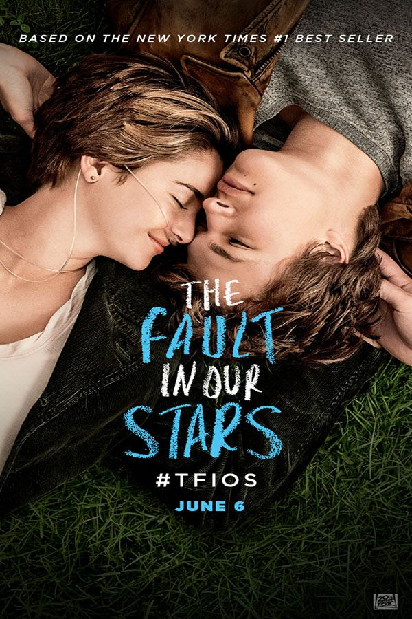
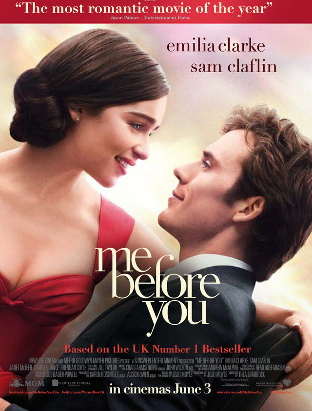
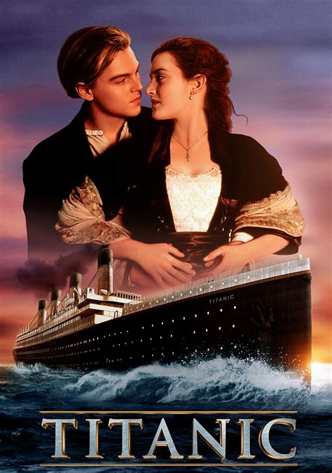

**Romance typography take 1: ACTION!**

Typography should inspire and entrance the audience. Needing to capture the delicate and romantic outlook of the films.

## The fault in our stars

“The fault in our stars” uses a very handwritten and low contrast typeface almost looking like it has been written with chalk this also being helped with the lightweight look. The casual and organic look can show the demographic for the film is aimed towards a younger audience (teens). With the letters still being all caps with a fairly even cap-height even with the organic look. The colours also can represent the movie well; with not only being used to stand out from the darker background but also with blue and white, while not being traditional romantic colours like the normal red and pink, can represent the colours you would normally find in a hospital, like doctors and nurses’ scrubs, this plays in well with the movie has it is about to ill and dying teenagers.

## Me before you

“Me before you” uses a more classic romantic typeface than the fault in our stars, with the use of serifs and low thickness ratio, given a scripted mature and elegant look, showing that the demographic is to an older audience.

Some of the letters are also joined together, notably the ‘M’ in me and ‘B’ in before, this can relate to the relationship of the two main characters in the movie being connected. The colours for the surrounding words are red, a colour often associated with love and romance, represents the movie well but these being different from the title with that being a nearly white cream, adding to the maturity and elegance, with also projecting delicacy, representing how delicate their relationship is with the protagonist also being terminally ill. Death seems to be a big theme in romance movies.

## Titanic

“Titanic” is probably one of the most iconic romantic films in the world.

 The typography of the title uses serifs and a slight 3D effect to project a classic look. The expansive letters using negative space to give an expensive luxury look. This can relate to the movie as one of the characters is wealthy while the other is poorer. This can also be seen in the use of colour with the silver front and gold underlay of the 3D effect, an almost metallic look going with the same materials as the ship as well as the sharpness and structure of the letters. The title is also slightly boxed in with two lines going over the top and underlining it, this again gives it a sense of structure and strength, representing how strongly the two characters feel, but it can also be seen as being trapped/encased just like how the characters were trapped on the ship as it was sinking.