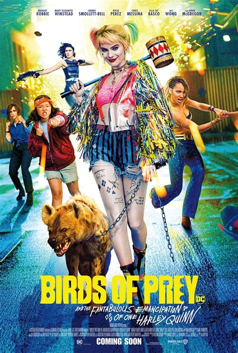
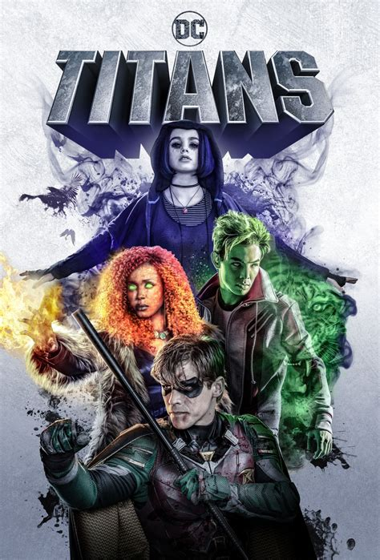

**Super typography take 1: ACTION!**

Typography is important when it comes to all movies, but especially in super ones. They need to be as big and as loud as the movie/character it is trying to present.

## Birds of prey and the fantabulous emancipation of one Harley Quinn

“Birds of prey and the fabtabulous emancipation of one Harley Quinn” does just this.

The main name of the movie ‘birds of prey’ is in a bright yellow typeface with a high contrast, mirroring a lot of the neon clothes she wears in the movie, showing that the main protagonist is bold and crazy. The main text also being in all capitals and in monospace, making it hard to miss. And also the imagery used to make the letters hide ‘easter eggs’ of the film, with a bow and arrow, dagger, baseball bat, diamond and knuckle dusters making up the letters, showing it is an action-packed film.

The sub-heading of the film ‘and the fabtabulous emancipation of one Harley Quinn’ has a handwritten more organic look to it with uneven cap heights to the letters, with also the word ‘Fantabulous’ being made up, this along with the doodles around the letter and use of a heart to dot the ‘I’ in Quinn give a novelty effect and a crazy playful, carefree element, which perfectly embodies Harley Quinn, giving her crazy, fearless and playful characteristics.

## Titans

“Titans”, the DC Tv show, again has a very bold title. With the typeface almost ‘exploding’ out of the poster by the use of the 3D effect it has, giving the opinion that it is also an action-packed show with strong characters, with the 3D effect also being seen in the use of comic books, which ties in the show with its original origins as a comic book.

The title is a rigid monospace in a blocky san serif font with high contrast on the 3D effect but a lower contrast on the actual letters themselves, with the bold white outline, as well creating an almost ‘metal’ or ‘stone’ appearance. There is no real big contrast or crazy colours between the background and title; unlike the ‘Harley Quinn’ poster, giving the audience and perspective viewer the sense that the show is more on the darker serious side.

## Guardians of the Galaxy

“Guardians of the galaxy” has used another monospace typeface with the title with the baseline also being the same throughout, just like the previous one. However, it uses the use of slight serifs to create a sharp regal gagged look. With it being more on the rigid digital side, it is perfect for an action Sci-Fi feature. 

This rigid and sharp look can also represent the characters well as the same sharpness can be seen in Gamora’s swords and the gold metallic colour is like the material of a space ship again bringing in the Sci-Fi elements. 

The high contrast of the gold to the dark background makes the title stand out, even with the busy images and many characters on the poster. Showing that because of its comic book roots the name ‘Guardians of the galaxy’ is already quite well know and due to the community of marvel fans surrounding it, it already has a large following.

The typography of the logo marvel is iconic, as being one of the biggest movie franchises. The bold monospaced white letters against the scarlet background creates drama and explosive look, going perfectly with the action-packed superhero movies they are best known for. 

**Cut!**