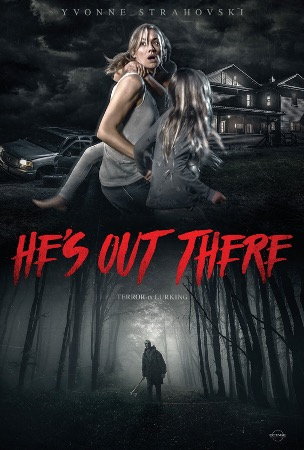

Horror typography take 1: Action!

Typography should creep out audiences, make them feel on edge when it comes to horrifying films.

## Trick 'r Treat

'Trick 'r treat' provokes this by using handwritten looking typography, this with the missing 'o' to abbreviate 'or' gives it a childish effective, like if it was a child that had craved it; which is appropriate as the movie focuses on one child in particular (Sam \[pictured on the poster]). The chaotic and random aspects of the typography are commonly used in scary movies posters, as it can make it more creepy to the audience, as when you look closer nothing is what it seems. For example the random changes to Capitals to small caps like the 'A' in 'treat', and the differences in 'X' heights and baselines between the letters. 

The most noticeable creepy aspect of the typography is the use of colour and the 3D effect of the title to make it look like it is on fire or has been written using fire, this goes with the movie as the main character is dressed as a jackal lantern, which normally has fire within, with the colours complimenting and matching the rest of the poster making it all connecting with the offset shadows. 

## The Hallow

'The Hallows' title is a novelty with the typography of the title making it look like trees (the trees of the hallow). With the unnerving handwritten look that 'trick or treat' also possessed. However, this title has a more organic look to it as the main focus of the film is of course the forest that surrounds the main characters (the hallow), using the main theme for the title shows how overpowering it is, with the title almost 'growing' from the page out of the images of the trees, encapsulating how the forest will absored and overwhelm you. 

This is also helped by the slight monospacing of the letters and how they are all in capital letters, with the runoff of the letters as well being prominent. Giving it the contrast of a grand and eerie look.

The sickish looking yellow colour used in the title shows the genre quite well as it provokes unnerving feelings, this with the withered look of the thinness and uneven contrast of the letters provides a disease-ridden look, which also goes well with the film as it fungi and 'natural' disease which intrigues the characters to the hallow in the first place. The character is also brought in by the use of the glow from the fire of the scythe in the image that can be faintly seen illuminating the title. 

## He's out there

