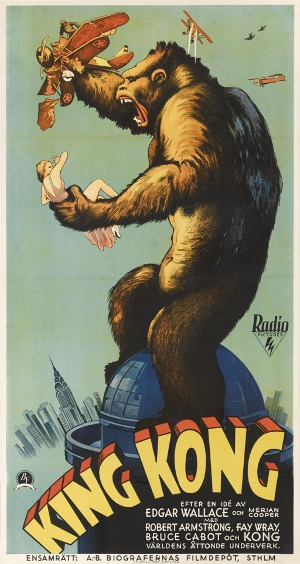
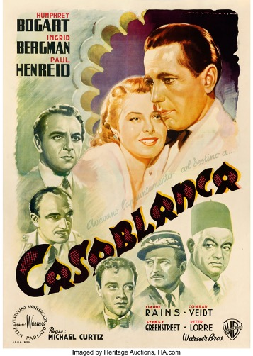
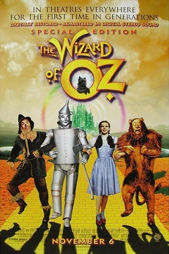

**Classic typography take 1: Action!**

A lot of movies throughout the years have been deemed by society as being 'one of the classics'. The typography used in the official movie posters needs to be timeless and unforgettable, whilst representing the movie in question.

## King Kong

The movie King Kong does just this, with its serval remakes, the newest being King Kong vs Godzilla (2021), it has gone down as one of the classics. The typography used has also become classic, with the big san serif font almost representing the iconic size and strength of King kong himself. The boldness of the typeface is helped by the width and weight of the text being thick and heavy and the contrast of the letter's thickness being monospaced.

The colour's used help create a contrast from the background colour with the yellow and orange also making a 3D effect to the words, making the title stand out more. This rigid, pop art-like style was coming into effect at the time with this coming out about 20 years earlier (1933) to the pop-art movement in the 1950s, with the style of imagery complements the time period well and shows the tone and themes of the movie perfectly.

## Casablanca

The Casablanca title has a novelty typeface with the most noticeable aspect being every 'A'  in Casablanca looking almost like spades from a deck of cards, giving a nod to a reference in the movie with playing cards. The typeface also conveys where the movie is set, Casablanca, Morocco, with the font mirroring the same style as a stereotypical Moroccan font.

The title also uses red scouring in the letters of the text to help add dimension and could also represent the theme of love and passion in the movie as red is often associated with romance. The black background and yellow shadowing also purveying death and happiness which can be seen as other themes in the film. There is also a big contrast of the thickness in the letters, going from very thick and top-heavy lettering to thinner and weaker looking bottom, almost making the title look unstable and that it will fall over, this additionally adding another element of the film, instability, and uncertainty. 

## The Wizard of Oz

The Wizard of Oz is probably one of the most iconic and classic musicals ever, with the typography in the poster conveying many iconic themes that take place in the movie. 

The most noticeable would be how the whole title is made up (filled) with yellow bricks, giving a reference to the yellow brick road, and the outline being red symbolising the classic ruby slippers and even the meadow of poppies the characters fall under a spell in. The two diamonds under the title also representing the two witches and Emerald City.

The font in general is very whimsical, with a slight seif and big uneven lettering, with all of the different base or cap heights, with the 'W' in 'Wizard' being flamboyant almost representing how the wizard has to appear to not be exposed. The 'W' also mirrors that of Willy Wonka's typography style in 'Charlie and the chocolate factory' which came out in 1971 about 60 years after Wizard of Oz, with that also being a similar kind of musical, it could be argued the producers wanted to match the success of the film by reminding people of another beloved musical which also was magical and whimsical.