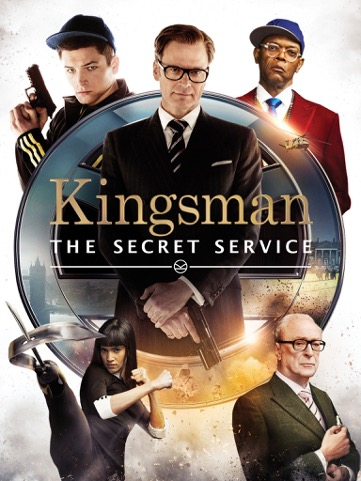
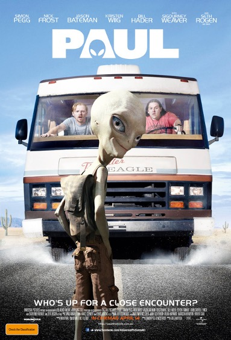

**funny typography take 1: ACTION!**

Typography should be able to instilL humor into audiences, to purvey what kind of humor the comedy is and the general tone of the movie. 

## Bad Teacher

The typography in Bad Teacher shows the theme of the show immediately with the title being written in chalk, with smudges all around it, showing the characters uncaring attitude. It also has the word 'bad' in all capitals with a monospaced bold look with a thick type of font, drawing empathises towards that she is a 'bad' teacher. This is also helped with the word 'teacher' keeping the same all capitals tone but is now a lot more handwritten with the cap heights being slightly different on each letter creating a haphazard appearance, portraying the character as not being passionate about being a teacher.

The handwritten effect is ongoing throughout the poster with a subheading showing a handwritten note of 'eat me' on an apple, again playing in the role of teacher, but the use of wording and the exclamation mark after empathising to the bad side. this plays in humor as teachers are stereotypically meant to be neat and caring, so already the typography is playing against that.  

## Kingsman

Kingsman doesn't use a stereotypical type of typography for a comedy, with comedies with normally bold, all capitals and novelty fonts. Kingsman uses a serif, times new roman font, in gold for the main title of 'Kingsman', creating a royal, elegant and sophisticated appearance. However, this fits well with the theme of the movie as it is about British secret agents that have the theme of King Arthur and his knights. 

The word 'Kingsman' is quite different from the sub-title 'the secret service', this shows the audience that 'kingsman' is the franchise and 'the secret service' is the title of the movie, this helps with the continuity of a series of films (3 by December 2021). The sub-title switches to a san-serif font with the white letters all capitals and a monospaced typeface, with the use of big spaces in between the words to add a sense of importance by the use of white space. The sub-title is also underlined in the same white colour with a symbol of the 'organisation' matching it in the middle directing more attention to the name of the film.

## Paul

Paul uses a big and simple typeface, with massive bold clean white letters. Using monospaced and rigid lettering. With the use of SCIFI and the main character being an alien, this makes sense. It also goes with the genre of comedy as it is short and bold, fitting with the type of jokes used, being quick and snappy with bold premises. 

This kind of typography, with bold and simple types, is quite common as it stands out and is easier for the audience to remember, hopefully, so people will remember the title and go and see the movie. This can be seen in such movies like Disney's 'UP' and Univeral's 'JAWS'.

The most notable thing in the title would be the novelty imagery of an iconic Alien head being used to make the letter 'A'. This head also looks like the main character 'Paul', showing the audience that he is again the center of the film, matching a self-centered attitude the character has.