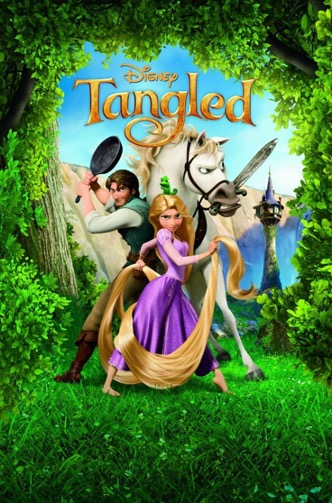
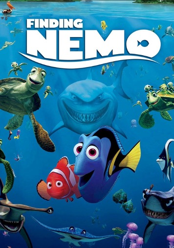
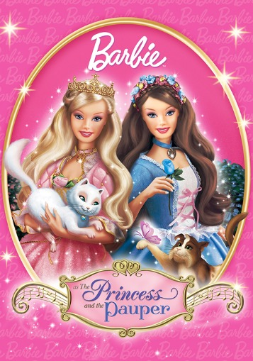

**childish typography take 1: ACTION**

Typography should grab your attention and memorable ones should stay with you. Creating magic for children's imaginations. 

## Tangled

The magical land of princesses that is Disney needs to match the iconic brand. This typography uses a classic serif font and a gold metallic colour to symbolise the royalty and princess stature of Rapunzel. It also uses the dramatic flick of the 'G' to mirror her hair, (which is a major theme of the movie). This also represents the time period the film was based in as dramatic loops and serif handwritten fonts were the handwriting of the monks (who were some of the only people who had the ability to write).

However, along with the elegancy of the typeface, there is also a roughness and a worn look to the typography, using a slight dark outline and dark patches to the gold lettering to mirror the other main character that's a thief and not royalty. It also shows that the princess didn't grow up royal and instead was kept in a worn tower and matches her adventures nature because it purveys use and wears instead of being pristine. Almost like how an old treasure map would look.

## Finding Nemo

Finding Nemo is one of the most iconic children's films ever. With nearly everyone having watched. The typography it uses is big and bold. With crisp white colouring of the letters on a blue background with the use of capitals creates a strong and attention-seeking look, this could mirror the urgency and the seeking for Nemo by Marlin. The word 'Finding' uses monospaced rigid capitals with Nemo matching this, however, the word 'Nemo' has a twist.

Though 'Nemo' has the same monospaced look with equal cap heights of the letters, the baselines of each letter are all different due to the underlining of the word. This underline is smooth and flows across, giving an almost caligraphy look to it, which in turn represents a wave of the ocean, referencing the ocean. The wave effect is also encompassed by how the letter has been cut off where the 'wave' is, creating the imagery of how waves cut into the sand. the references to the ocean and the creatures inside can also be seen in the 'O' of Nemo to make the 'O' they have used a silhouette of a fish, which can represent Nemo, drawing the focus back to the missing fish.

## Barbie: as the princess and the pauper

The typography of 'the princess and the pauper' uses juxtaposition to show the differences and similarities of the two characters. For the word 'Princess', they use big handwritten calligraphy style font with massive loops and flicks, this with the low consitancy of the thickness of the lettering creating 'flicks', giving it a elegant, regal and high educated and profile look, with the use of purple couring also representing the regalness of the princess.

For the word 'Pauper' the typeface is more subdude, with the use of blue colouring represeting a less royal look than the purple, with the colour also matching the blue of the character is consitanly seen in. The consitancy of the thickness of the lettering is more even and even though it also has a handwritten look the serifs and loops/flicks are smaller, less showy and more practical with the use of straight lines and unjoined letters, representing how the pauper has to work and be more pratical with her hands where the princess is more of a diplomat and a figure head, designed to be perfect.