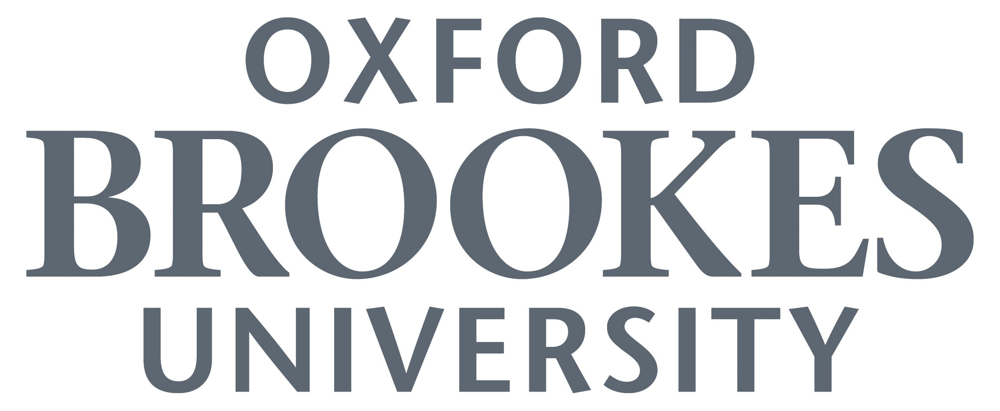
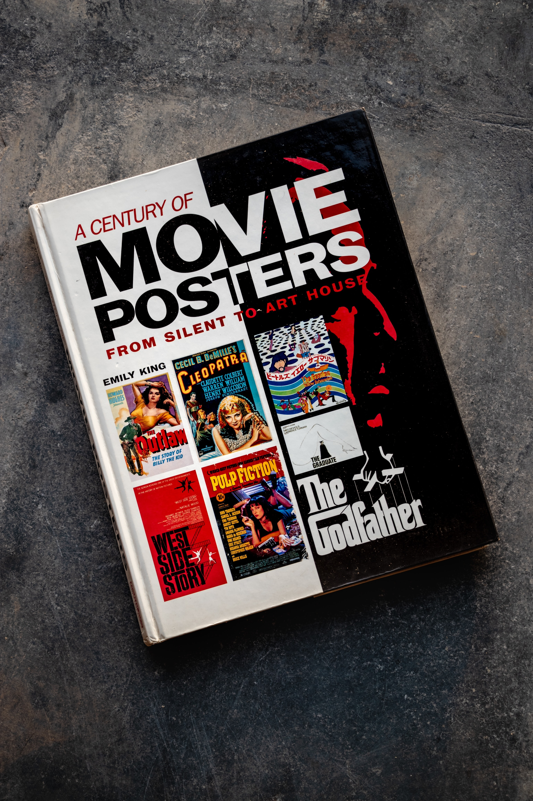

**Action!**

Hi, I'm Isabel Lawton and this is my blog all about the typography you see in movie posters, from past to present. 

I've lived in the UK all my life, go to university at Oxford Brookes and I am a big movie lover.

 With all the constant stream of new entertainment coming out rapidly, movie marketers have to keep their designs fresh and exciting if they want their movies to stand out. This blog looks at how they do that through the use of typography, by the typeface, composition and colour. 

**Cut!**